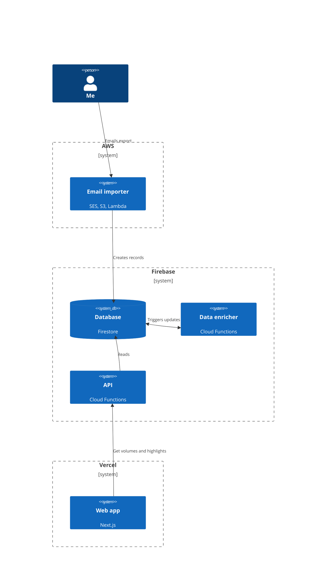

## Overview

Hello 👋 You're at the root of a monorepo.

This repo contains all of the code for my personal reading highlight system. You can read more about this project in [this blog post](https://sawyerh.medium.com/how-i-export-process-and-resurface-my-kindle-highlights-addc9de9af1a).

## Directory Structure

```
├── aws       # Email importer and AI/LLM features
├── firebase  # Database and backend
├── packages  # Reading export converters
│   ├── highlights-email-to-json
│   ├── kindle-clippings-to-json
│   ├── kindle-email-to-json
│   └── safari-books-csv-to-json
└── web       # Frontend
```

## Installation

### Pre-requisites

- Node.js 18+
- Python 3.10+
- [poetry](https://python-poetry.org/docs/#installation)

### Setup top-level dependencies

To setup developer tooling, like linting and formatting:

```
make init
```

Then, each individual directory has its own README with setup instructions.

## System context


