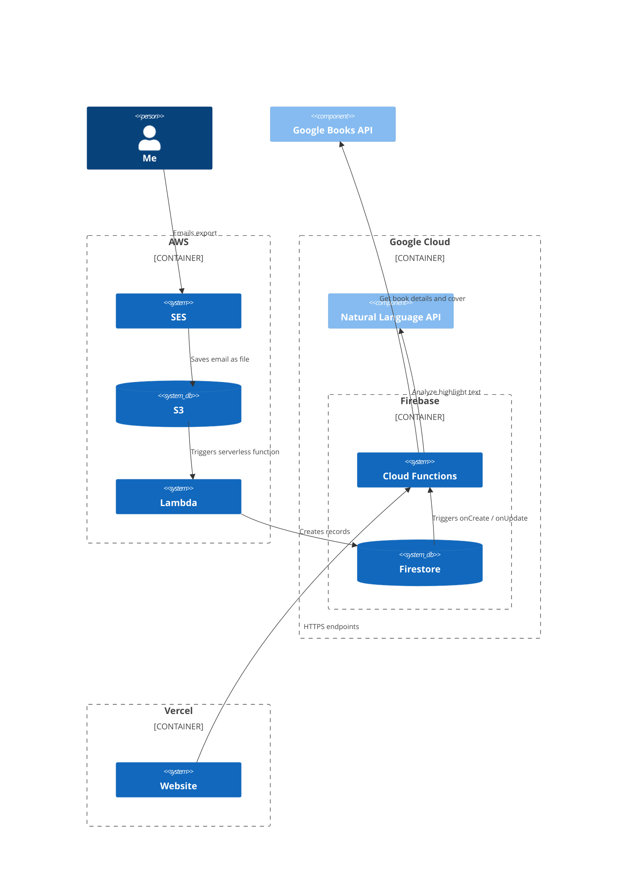

Hello 👋 You're at the root of a monorepo. Within this repo are several different packages:

| Name                                                             | Description                                                                                                                                                                                                                                                                                                               |
| ---------------------------------------------------------------- | ------------------------------------------------------------------------------------------------------------------------------------------------------------------------------------------------------------------------------------------------------------------------------------------------------------------------- |
| [`kindle-email-to-json`](packages/kindle-email-to-json/)         | Converts an email export of Kindle notes into a JSON object.                                                                                                               |
| [`kindle-clippings-to-json`](packages/kindle-clippings-to-json/) | Convert an email including Kindle clippings into a JSON object.                                                                                                |
| [`highlights-email-to-json`](packages/highlights-email-to-json/) | Converts an email of plain text notes into a JSON object. You can use this for a lot of things — I primarily use it as a way to import Instapaper highlights.  |
| [`safari-books-csv-to-json`](packages/safari-books-csv-to-json/) | Converts an email attachment consisting of an O'Reilly Safari Books CSV highlights export into a JSON object.                                                  |
| [Email Handler](packages/aws-lambda-email-handler/)              | An AWS Lambda function for handling the receiving of an email export                                                                                                                                                                                                                                                      |
| [SMS Handler](packages/aws-lambda-email-handler/)                | An AWS Lambda function for sending a daily SMS of a random highlight                                                                                                                                                                                                                                                      |

**For more background about this project, [read this blog post](https://medium.com/@sawyerh/how-i-export-process-and-resurface-my-kindle-highlights-addc9de9af1a).**

## System diagram

