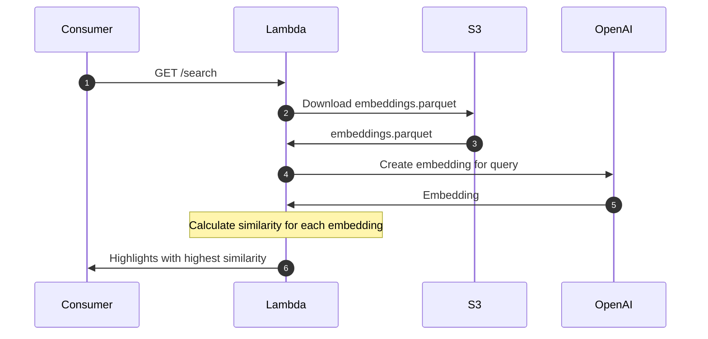
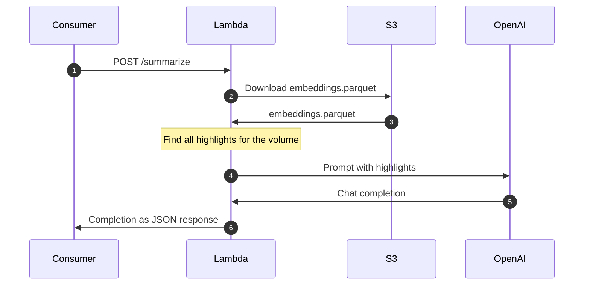

## How it works

### Search

### Summarize

# Serverless AI

This directory contains the code supporting features like Semantic Search and Summarization.

## Initial environment setup

1. Add a **plaintext** secret to AWS Secrets Manager with the name `Highlights/OpenAI-API-Key`. Set the OpenAI API key as the plaintext value.
1. Create the initial set of embeddings.
   1. [Export the Firestore data](../../firebase/exporter/instructions.md)
   1. Place the Firestore export in the `tmp` directory
   1. Run `export OPENAI_API_KEY=[your key here]`
   1. Run `make create-embeddings`
   1. Upload the outputted `tmp/embeddings.parquet` to S3

## Resources

- Lambda management is via [Serverless Framework](https://www.serverless.com/framework/docs)
- [Powertools for AWS Lambda](https://docs.powertools.aws.dev/lambda/python/latest/) provides a toolkit to implement Serverless best practices and increase developer velocity
- [AWS SDK for pandas](https://aws-sdk-pandas.readthedocs.io/en/stable/index.html) provides a toolkit to read and write Pandas DataFrames to and from AWS data stores like S3.
- Test mocking and spying is via [`pytest-mock`](https://pytest-mock.readthedocs.io/en/latest/usage.html)

## Usage

Reference the `Makefile` for the full list of commands. More commands are available via the Serverless CLI.
