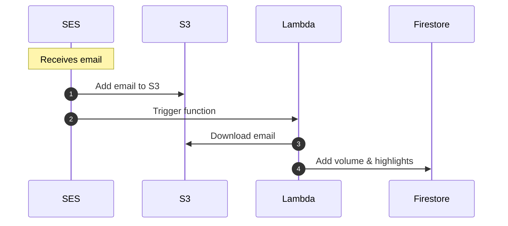

## How it works



## Installation

Deploying and local testing requires:

- [AWS SAM CLI](https://docs.aws.amazon.com/serverless-application-model/latest/developerguide/install-sam-cli.html)
- [Docker](https://docs.docker.com/install/)

## Deploying

TODO: Add SAM CLI deployment instructions

## Configuration

The Lambda function relies on the following environment variables. You'll need to set these to test locally:

- `AWS_ACCESS_KEY_ID`
- `AWS_SECRET_ACCESS_KEY`
- `KEY_PREFIX` - The directory within the bucket where the email objects can be found (SES only gives us the message ID, which is used for the object's name).
- `S3_BUCKET` - The bucket where the emails are added to
- `SERVICE_ACCOUNT` - Google Cloud Service Account JSON object

## Testing locally

### Prerequisites

Firebase calls will be ran against the emulator, however local testing still relies on connecting to a real S3 bucket with an email file existing.

1. Create a bucket in S3
1. Add an email to the bucket (you can use [`fixtures/email.txt`](fixtures/email.txt))
1. Create an IAM user with access to the bucket and copy the credentials
1. Set the environment variables in a `env.json` file within the package directory. (See `env.example.json`).
1. Log into the `aws` cli with the IAM user credentials: `aws configure` or `EXPORT AWS_PROFILE=profile-name`

### Triggering the function

1. Run the Firebase emulator in a separate terminal (see [`firebase/README.md`](../../firebase/README.md)).
1. Update the mock event in `scripts/test.sh` so that `messageId` is the name of the email file in S3 (e.g. `messageId: "email.txt"`).
1. Run:
   ```sh
   sam build && sam local invoke -e events/event-ses.json --env-vars env.json
   ```

If you run into errors, you can set the `--log-file` flag to see the output of the Lambda function:

```sh
sam local invoke -e events/event-ses.json --env-vars env.json --log-file sam.log
```

---

### Setting up AWS SES (and S3)

**Heads up: These screenshots are outdated, but hopefully still useful.**

Setup AWS SES to store received email in an S3 bucket: http://docs.aws.amazon.com/ses/latest/DeveloperGuide/receiving-email-setting-up.html

There are a couple ways you can set this up, but here's what I did:

Through my domain registar I created a specific subdomain for receiving my highlight emails (eg my-highlights.example.com) and [verified my domain](http://docs.aws.amazon.com/ses/latest/DeveloperGuide/receiving-email-verification.html) using a TXT record.


In AWS SES I added my verified domain


and created a rule set that would send my emails to S3 (you can create the bucket in this step if one doesn't already exist)


### AWS Lambda

Create a new [AWS Lambda](https://aws.amazon.com/documentation/lambda/) function using the code in this directory (you can upload it as a Zip).


After your Lambda function is created, add an event source to it that listens for Object Created events in S3. Now your Lambda function will be called anytime a new object is added to the S3 bucket you setup to store your emails.


