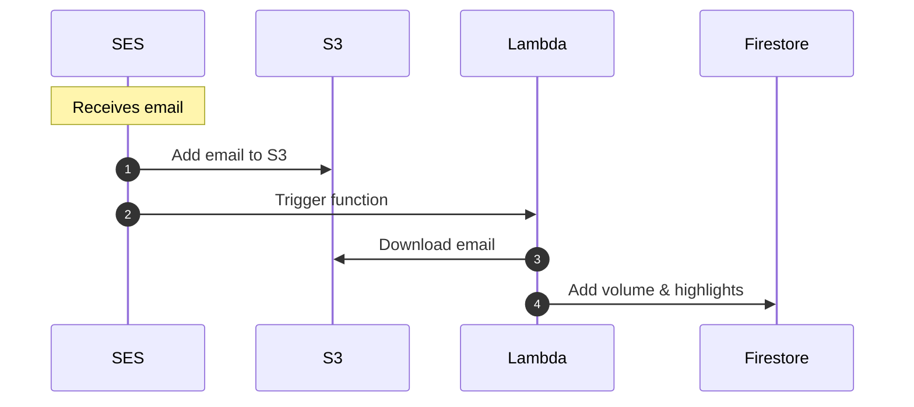
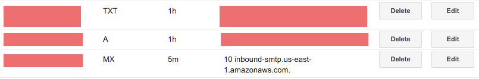
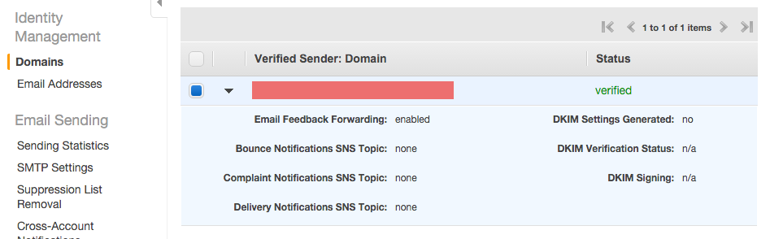
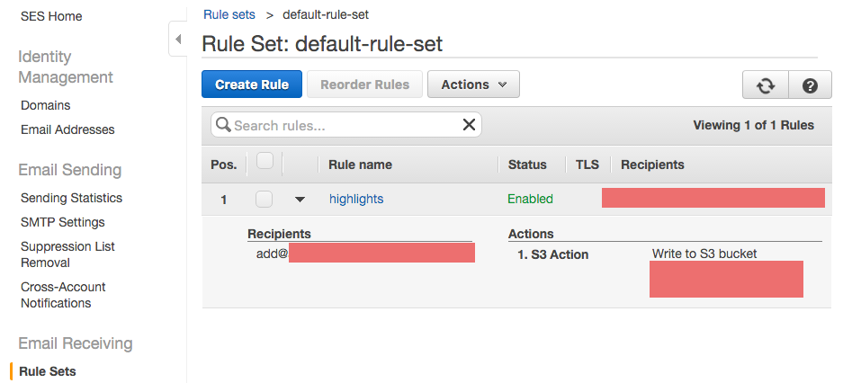
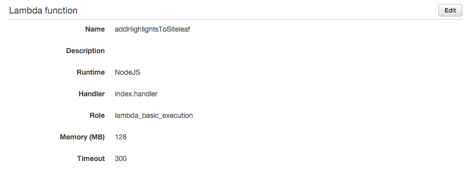
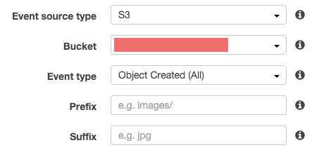

## How it works



## Deploying

Deploy the handler to Lambda. This script copies the files into a `dist` directory and installs production dependencies.

### Prerequisites

- Docker is installed
- [`trash`](https://github.com/sindresorhus/trash-cli) is installed
- An AWS profile is configured

```
npm run deploy
```

## Configuration

The Lambda function relies on the following environment variables. You'll need to set these to test locally:

- `AWS_ACCESS_KEY_ID`
- `AWS_SECRET_ACCESS_KEY`
- `KEY_PREFIX` - The directory within the bucket where the email objects can be found (SES only gives us the message ID, which is used for the object's name).
- `S3_BUCKET` - The bucket where the emails are added to
- `SERVICE_ACCOUNT` - Google Cloud Service Account JSON object

### Testing locally

Set the environment variables in a `.env` file within the package directory. Then run:

```
npm test
```

---

### Setting up AWS SES (and S3)

**Heads up: These screenshots are outdated, but hopefully still useful.**

Setup AWS SES to store received email in an S3 bucket: http://docs.aws.amazon.com/ses/latest/DeveloperGuide/receiving-email-setting-up.html

There are a couple ways you can set this up, but here's what I did:

Through my domain registar I created a specific subdomain for receiving my highlight emails (eg my-highlights.example.com) and [verified my domain](http://docs.aws.amazon.com/ses/latest/DeveloperGuide/receiving-email-verification.html) using a TXT record.



In AWS SES I added my verified domain



and created a rule set that would send my emails to S3 (you can create the bucket in this step if one doesn't already exist)



### AWS Lambda

Create a new [AWS Lambda](https://aws.amazon.com/documentation/lambda/) function using the code in this directory (you can upload it as a Zip).



After your Lambda function is created, add an event source to it that listens for Object Created events in S3. Now your Lambda function will be called anytime a new object is added to the S3 bucket you setup to store your emails.


