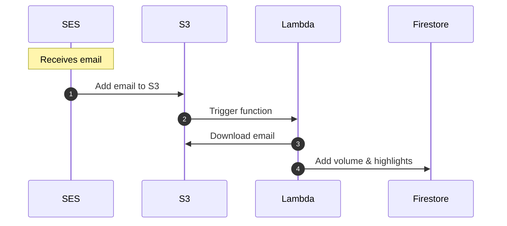

## How it works



## 🧰 Local development

There's a few ways to test this locally:

1. Through the test suite. See below. This runs against a local Firebase emulator.
2. Run `make invoke-local` to use the Serverless CLI to [invoke the function directly](https://www.serverless.com/framework/docs/providers/aws/cli-reference/invoke-local). By default, this uses a test event with a `test: true` property, in order to not make requests to the database.

## 🧪 Testing

- Tests run against the Firebase emulator, which depends on the Firebase CLI being installed globally
- A fake Firebase project, including a fake service account, is used for tests.

### Run tests

```
npm test
```

In watch mode, you can view the Firebase emulator UI at http://localhost:4001:

```
npm run test:watch
```

By default, the database is cleared after each test. If you want to keep the data between tests, disable the call to `cleanup` in `tests/_setup.ts`.

If you don't see data in the emulator, but expect to, make sure the Firebase CLI is using the same project as the tests: `firebase use <project id>`

---

## 🚀 Deployment

### Prerequisites

Two [SSM Parameters](https://us-east-1.console.aws.amazon.com/systems-manager/parameters) need created:

1. A `SecureString` with the name of: `/Highlights/Google-Service-Account`. Add the Google Cloud Service Account JSON object as the value.

For other one-time configuration, see `serverless.yml`.

### Deploying

The Serverless Framework is used to deploy the Lambda function. The `Makefile` provides a shortcut for deploying.

1. `make deploy`

More commands are available via the Serverless CLI.

To verify the new version, you can use a test event with a `test: true` property. One is pre-configured and can be ran using:

```
make invoke-with-test-event
```

## Setting up AWS SES (and S3)

**Heads up: These screenshots are outdated, but hopefully still useful.**

Setup AWS SES to store received email in an S3 bucket: http://docs.aws.amazon.com/ses/latest/DeveloperGuide/receiving-email-setting-up.html

There are a couple ways you can set this up, but here's what I did:

Through my domain registar I created a specific subdomain for receiving my highlight emails (eg my-highlights.example.com) and [verified my domain](http://docs.aws.amazon.com/ses/latest/DeveloperGuide/receiving-email-verification.html) using a TXT record.


In AWS SES I added my verified domain


and created a rule set that would send my emails to S3 (you can create the bucket in this step if one doesn't already exist)


