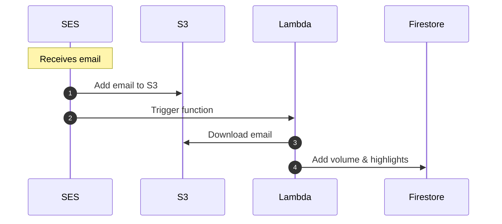

## How it works



## 🧰 Local development

The easiest way to run the Lambda function locally is likely through the test suite. I haven't had much luck using `sam local invoke`. See instructions below for running the tests.

## 🧪 Testing

- Tests run against the Firebase emulator, which depends on the Firebase CLI being installed globally
- A fake Firebase project, including a fake service account, is used for tests.

### Run tests

```
npm test
```

In watch mode, you can view the Firebase emulator UI at http://localhost:4001:

```
npm run test:watch
```

By default, the database is cleared after each test. If you want to keep the data between tests, disable the call to `cleanup` in `tests/_setup.ts`.

If you don't see data in the emulator, but expect to, make sure the Firebase CLI is using the same project as the tests: `firebase use <project id>`

---

## 🚀 Deployment

### Prerequisites

- [AWS SAM CLI](https://docs.aws.amazon.com/serverless-application-model/latest/developerguide/install-sam-cli.html)

The Lambda function relies on the following environment variables:

- `KEY_PREFIX` - The directory within the bucket where the email objects can be found (SES only gives us the message ID, which is used for the object's name).
- `S3_BUCKET` - The bucket where the emails are added to
- `SERVICE_ACCOUNT` - Google Cloud Service Account JSON object, for authenticating with Firebase

### Deploying

1. `npm run build`
1. Upload the `build.zip` file to Lambda
   ```sh
   aws lambda update-function-code --function-name highlightsEmailToFirebase --zip-file fileb://build.zip --publish
   ```

To verify the new version, you can use a test event with a `test: true` property. This will prevent the function from adding data to the database. Set `messageId` to the name of an email object in the S3 bucket.

```json
{
	"test": true,
	"Records": [
		{
			"ses": {
				"mail": { "messageId": "email.txt" }
			}
		}
	]
}
```

## Setting up AWS SES (and S3)

**Heads up: These screenshots are outdated, but hopefully still useful.**

Setup AWS SES to store received email in an S3 bucket: http://docs.aws.amazon.com/ses/latest/DeveloperGuide/receiving-email-setting-up.html

There are a couple ways you can set this up, but here's what I did:

Through my domain registar I created a specific subdomain for receiving my highlight emails (eg my-highlights.example.com) and [verified my domain](http://docs.aws.amazon.com/ses/latest/DeveloperGuide/receiving-email-verification.html) using a TXT record.


In AWS SES I added my verified domain


and created a rule set that would send my emails to S3 (you can create the bucket in this step if one doesn't already exist)


### AWS Lambda

Create a new [AWS Lambda](https://aws.amazon.com/documentation/lambda/) function using the code in this directory (you can upload it as a Zip).


After your Lambda function is created, add an event source to it that listens for Object Created events in S3. Now your Lambda function will be called anytime a new object is added to the S3 bucket you setup to store your emails.


