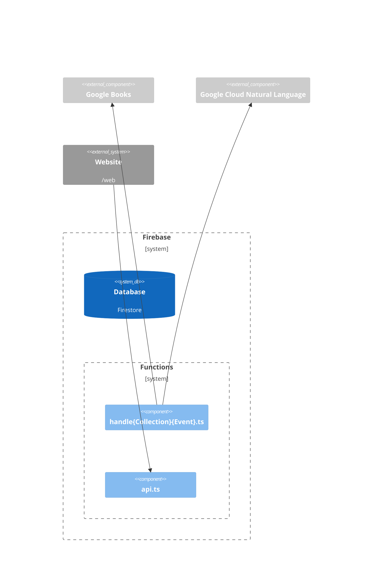

## Overview

Firebase is used for our database and serverless backend.



## 🐣 Creating a new Firebase project

1. Create a new Firebase project in the [Firebase console](https://console.firebase.google.com/).
1. Enable billing for your project.
1. Create a new Firestore database in the project, in production mode.
1. [Enable the Natural Language API](https://console.cloud.google.com/flows/enableapi?apiid=language.googleapis.com)
1. Add an app to the Firebase project: `firebase apps:create web <app name> --project <project id>`
1. Configure the app to use the Firebase project: `firebase use <project id>`

## 🔑 Service accounts

A service account is used to authenticate the app to Google Cloud services, such as the Natural Language API. To run the app or tests locally, you must create a service account key:

1. Create/obtain a JSON [Service Account](https://console.cloud.google.com/iam-admin/serviceaccounts) key. The default App Engine service account can be used to create the key.
1. Place the service account key in `/secrets/test-service-account.json`.

## 🧰 Local development

1. (Optional) In order for the Natural Language API integration to work, you must run:
   ```
   export GOOGLE_APPLICATION_CREDENTIALS=secrets/test-service-account.json
   ```
1. To run TypeScript compilation in watch-mode and the Firebase emulator with seeded data:
   ```
   npm run dev
   ```

## 🧪 Testing

### Setup test environment

Tests run against the Firebase emulator, however **other non-Firebase services (Google Books, Natural Language API) are live**, so you it's best to run tests against a test environment:

1. Setup a new Firebase project for testing following the steps above.
1. Login to the Google Cloud SDK:
   ```
    gcloud auth activate-service-account --key-file="secrets/test-service-account.json"
   ```
1. Copy the Firebase app config: `firebase apps:sdkconfig --project <project-id>`
1. Paste the config JSON into `/secrets/test-app.json`.

### Run tests

```
npm test
```

In watch mode, you can view the Firebase emulator UI at http://localhost:4000:

```
npm run test:watch
```

If you don't see data in the emulator, but expect to, make sure the Firebase CLI is using the same project as the tests: `firebase use <project id>`

### Exporting seed data

To update the DB seed data:

```
npm run emulators:export
```

### Switching projects

To switch between a test project and production, use the `firebase` cli:

```
firebase use PROJECT-NAME
```

### Non-HTTP functions

Run `npm run shell` to emulate an environment to test non-HTTP Functions.

You can [pass test data directly into the function](https://firebase.google.com/docs/functions/local-emulator).

For a Firestore function:

```js
handleHighlightCreate({ body: "Hello world" });
```

For an HTTP function, it's easiest to run `npm run dev` and then use the HTTP URL that's logged to the console.

## 🚀 Deployment

```
$ npm i -g firebase-tools
$ firebase login
$ firebase deploy
```

Deploys can specify a project or even a specific function, use the `--only` flag:

```
$ firebase deploy --project foo-bar --only functions:api
```

## 🕰️ Backups

Backups are not automated, however the entire database or a specific collection can be manually backed up using the [Firestore export tool](https://firebase.google.com/docs/firestore/manage-data/export-import).

[View all backups in Google Cloud Console](https://console.cloud.google.com/firestore/databases/-default-/import-export).

## Other tips

### Storage

To remove a file from Google Storage, copy the `gs://` path of the object, then from the CLI:

```
gsutil rm gs://[BUCKET_NAME]/[OBJECT_NAME]
```
